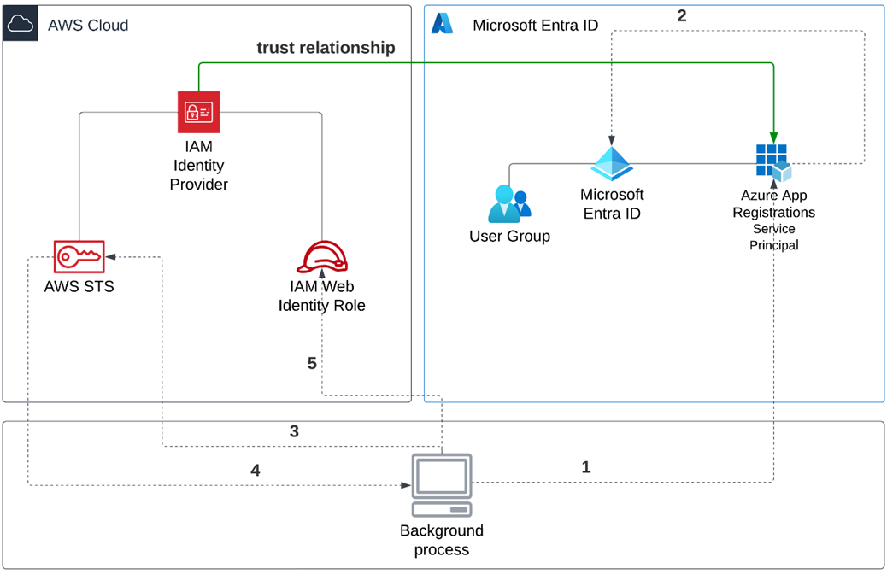
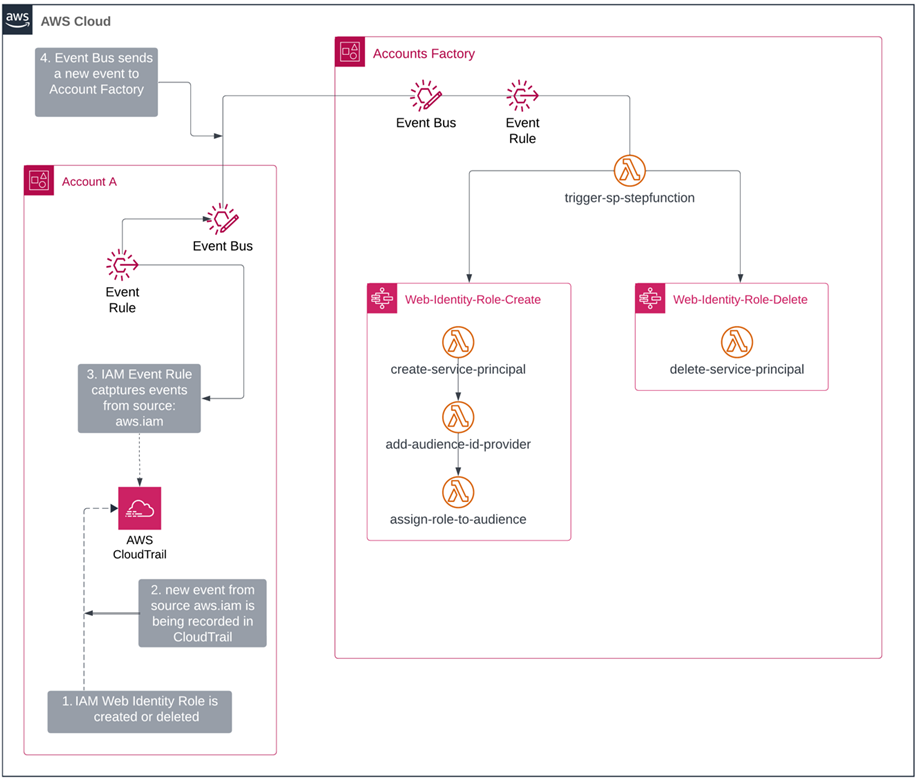

<!-- Slide 1: Title Slide -->
# Automating Secure OIDC-Based Cross-Cloud Authentication

## Borko Djurkovic

---

<!-- Slide: Key Takeaways -->
## Key Takeaways

- Do not use Access Keys and Secret Access Keys
- Use OIDC for secure system-to-system authentication
- Leverage automation at scale to improve security and reliability

---

<!--

Slide: About Me

Recommended podcast: Stuff You Should Know

-->
## ABOUT ME

<style>
@import 'https://cdnjs.cloudflare.com/ajax/libs/font-awesome/4.7.0/css/font-awesome.min.css';
</style>


👨🏻‍💻 Software Engineer

🗺 Ottawa, Canada

🏃🏻‍➡️ Runner

<i class="fa fa-podcast"></i> Podcast Listener

🔭 Physics Enthusiast

---


<!-- 

Slide: AWS IAM
Identity Management

- AWS IAM enables the creation and management of user identities (users, groups, and roles) within AWS.
- Each identity can be assigned specific credentials, such as access keys, to authenticate against AWS resources.
- Supports multi-factor authentication (MFA) for additional security when users access AWS services.

Role-Based Access Control (RBAC) & Permission Management
- Permissions are granted through policies that define what actions are allowed on specific resources.
- IAM uses roles to assign permissions, rather than assigning them directly to users, offering more flexible and scalable management.
- Fine grained access control helps implement the principle of least privilege by ensuring users only have the permissions needed for their role.

Federated Identity Integration (SSO, SAML, OIDC)
- IAM integrates with external identity providers (e.g., Microsoft Entra ID, Okta) to enable Single Sign-On (SSO) capabilities.
- Supports both SAML (Security Assertion Markup Language) and OIDC (OpenID Connect) for federating access to AWS and other applications.
- Enables seamless authentication from external directories, reducing the need for separate AWS credentials and improving security with centralized user management.

Temporary Credentials & Session Management
- AWS IAM allows for the issuance of temporary security credentials through AWS Security Token Service (STS).
- Ideal for situations requiring short-term access to AWS resources, such as third-party apps or external contractors.
- Temporary credentials are automatically revoked after a set time, reducing the risk of stale access permissions.

-->
## AWS IAM

### Provides Centralized Identity and Access Management

- Identity Management
  - Users, Groups, Roles
- RBAC and Permissions Management
  - IAM Roles, IAM Policies
- Federated Identities
  - SSO, SAML, OIDC
- AWS STS
  - Temporary Credentials and Session Management

---

<!--

Slide AWS IAM Authentication

- Access keys are used to authenticate users or services when interacting with AWS resources via the API, AWS CLI, or SDKs.
- An Access Key ID is public, while the Secret Access Key is private and must be kept secure.
- Together, they allow programmatic authentication without needing console credentials.
- The Access Key ID and Secret Access Key pair work like a username and password for API calls.
- Example: AWS Credentials File

-->
## Access Keys for Programmatic Authentication

- Access Key ID is public
- Secret Access Key is private
  - Must be kept secure

```bash
[user1]
aws_access_key_id=ASIAI44QH8DHBEXAMPLE
aws_secret_access_key=je7MtGbClwBF/2Zp9Utk/h3yCo8nvbEXAMPLEKEY
```

---

<!--

Slide: DO NOT USE SECRET KEYS

- Long-term access keys can be compromised if exposed or mishandled, leading to persistent security risks.
- Against prescribed security best practices.
- Managing access keys across multiple users, services, and systems becomes complex as environments grow.
- Access keys are harder to track and audit compared to roles with temporary credentials.
- Against corporate, enterprise, or regulatory security policies.
- Access keys are tied to specific IAM users, not roles or fine-grained policies.

-->
## DO NOT USE SECRET KEYS

- Security risk with long term credentials
- Against security best practices
- Difficult to manage at scale
- Against corporate security policies
- Lack of granular access control

---

<!--

Slide: OIDC

- OIDC is an authentication layer built on top of OAuth 2.0, enabling identity verification using tokens.
- OIDC extends OAuth 2.0 by providing additional ID Tokens that carry claims (user info) and scopes (permissions).
- This allows fine-grained authorization in apps by controlling what data users can access based on their identity.
- It allows applications to authenticate users via external identity providers (e.g., Google, Microsoft).
- OIDC is commonly used for Single Sign-On (SSO), allowing users to log in once and access multiple apps.
- Reduces the need for separate credentials.
- OIDC provides more secure and scalable user authentication compared to long-term AWS IAM access keys, which are prone to exposure and management overhead.
- OIDC tokens are short-lived and can be dynamically scoped, reducing the risk of stale or overly broad permissions that are common with IAM access keys.

-->
## OIDC enables federated identity management across applications and services

- Provides identity verification using tokens
- Enables fine-grained authorization using claims and scopes
- OIDC tokens are short lived and dynamically scoped
- Enables federated access allowing IdP's to authenticate users for third party apps

---

<!--

Slide: AWS OIDC

- AWS IAM OIDC (OpenID Connect) allows external identity providers (like Google or Microsoft Entra ID) to authenticate users for AWS services.
- It enables federated access, allowing users to sign in using their existing credentials, without needing separate AWS IAM user accounts.
- Supports temporary short-lived credentials
- Ideal for organizations that want to authenticate users from external identity providers like Google, Facebook, or enterprise SSO solutions.
- Useful for scenarios where users need access to AWS resources but should not have IAM user credentials (e.g., external contractors, third-party services).
- Reduces the risk of credential leakage by using short-lived tokens instead of long-term AWS IAM access keys.
- IAM Web Identity Roles allow users to assume AWS roles using tokens from external identity providers (such as OIDC-compatible services like Google, Facebook, or custom enterprise SSO solutions).

-->
## AWS IAM OIDC Service

- Integration with external OIDC IdP's for authentication to AWS
- Enables federated access and SSO
- Removes need for AWS IAM users and long-lived AWS IAM access keys
- External users assume AWS IAM Web Identity Roles

---

<!--

Slide: ENTRA ID

- Entra ID (formerly Azure Active Directory) allows organizations to manage users.
- Provides tools to manage lifecycle of uses such as provisioning and deprovisioning, access permissions.
- Governance and security - conditional access policies, MFA, advanced reporting
- Comprehensive cloud-based IdP
- Federated access enabling SSO via SAML or OIDC
- Provides ability to register applications and configuring OIDC, enabling obtaining tokens for API access

-->
## Entra ID = Azure based IdP

- Microsoft Azure based IAM solution
- Provides IdP functionality (e.g. user management)
- Application registration for external apps
- Identity governance

---

<!--

Slide: Integrated Solution

-->
## AWS + Entra ID Integrated Solution



---

<!-- Slide 8: TODO TITLE -->
## TODO TITLE
<style scoped>section { font-size: 20px; }</style>
The authentication and authorization process depicted are as follows:
- An external process (here it’s part of a CI/CD pipeline) logs in with an Azure service principal using a certificate-based authentication to gain an access token from Microsoft Entra ID.
- When a login with the service principal is successful, it authorizes the use of the Azure App Registration and provides the client with a token that specifies the roles, audience, and permissions available to the client in Azure/Entra ID.
- The client uses the token obtained from Microsoft Entra ID to exchange it with a temporary token from AWS Security Token Service (AWS STS).
- AWS STS generates a transient token with a short lifespan and dispatches it to the client.
- Finally, the client is able to take on the IAM Web Identity Role and gain access to the resources permitted for that role.

You might wonder about the authorization for AWS STS to exchange an Entra ID token for a token. This capability is enabled through the establishment of a trust policy within the IAM Web Identity Role.

---

<!--

Slide: Manual setup: Step 1

-->
## Manual Configuration - Step 1

### Application Registration in Entra ID

Microsoft Entra ID integration: Registering an application, creating a service principal, and setting up trust relationships in AWS.
Step 1: Create an Application in Microsoft Entra ID
Step 2: Configure OpenID Connect Provider
Step 3: Integrate IAM Web Identity Role into AWS

Picture of App registration in Entra ID

---

<!--

Slide: Manual setup: Step 2

-->
## Manual Configuration - Step 2

### AWS IAM OIDC Provider Configuration

Microsoft Entra ID integration: Registering an application, creating a service principal, and setting up trust relationships in AWS.
Step 1: Create an Application in Microsoft Entra ID
Step 2: Configure OpenID Connect Provider
Step 3: Integrate IAM Web Identity Role into AWS

Picture of AWS IAM OIDC Provider Configuration 

---

<!--

Slide: Manual setup: Step 3

-->
## Manual Configuration - Step 3:

### IAM Web Identity Role Configuration

Microsoft Entra ID integration: Registering an application, creating a service principal, and setting up trust relationships in AWS.
Step 1: Create an Application in Microsoft Entra ID
Step 2: Configure OpenID Connect Provider
Step 3: Integrate IAM Web Identity Role into AWS

Picture of AWS IAM Web Identity Role

---

<!--

Slide 10: Challenges of Manual Setup in Enterprise Environments

- Results in a violation of enterprise security policies and compliance because, when done by different individuals, it will result in varying approaches and setups.
- Needs substantial access privileges in both AWS and the IdP, potentially leading to significant security risks.
Requires a deep understanding of both platforms, a competence that can be lacking in many companies.


-->
## Challenges of Manual Setup in Enterprise Environments

- Violation of enterprise security policies
- Requires elevated privileges in both AWS and Entra ID
- Requires deep understanding of both platforms (AWS IAM and Entra ID)
- Different individuals use varying approaches and setups
- Manual configurations are error prone

---

<!--

Slide: Need for automation at scale

-->
## Need for automation at scale

AWS Organizations picture of enterprise accounts structure
Automating account creation via control tower or landing zone

---

<!--

Slide: Solution overview

-->
## Solution overview



---

<!-- Slide 13: Solution Components -->
## Solution Components

Table of components

---

<!-- Slide 14: Solution Components 2 -->
## Solution Components

Table of components

---

<!-- Slide 15: Addressing the Challenges Through Automation -->
## Addressing the Challenges Through Automation

Some stuff

---

<!-- Slide: Key Takeaways -->
## Key Takeaways

- Do not use Access Keys and Secret Access Keys
- Use OIDC for secure system-to-system authentication
- Leverage automation at scale to improve security and reliability

---

<!-- Slide: Info & Source Code -->
## Key Takeaways

Source Code: link

Blue Sky

Twitter

LinkedIn

TODO: Update above

---
