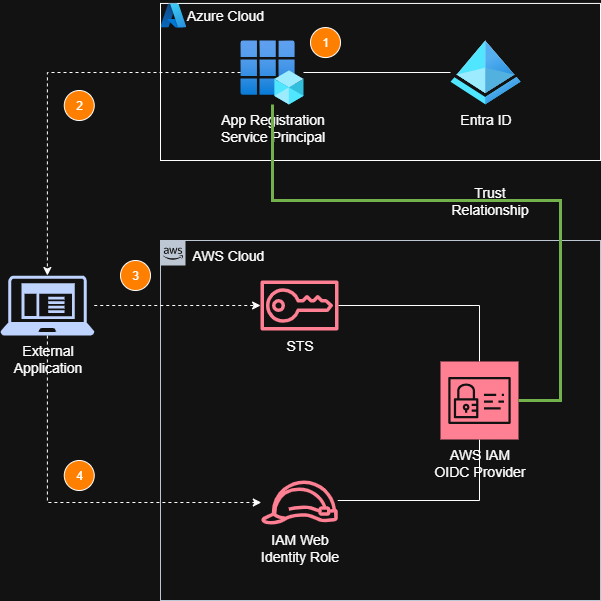
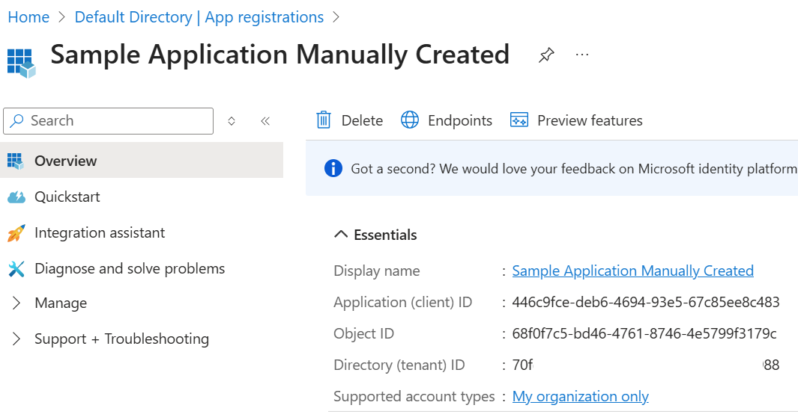
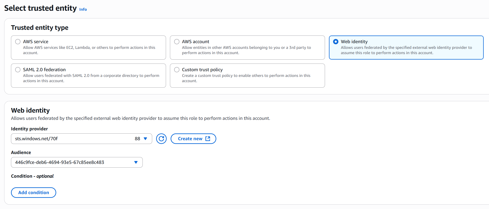
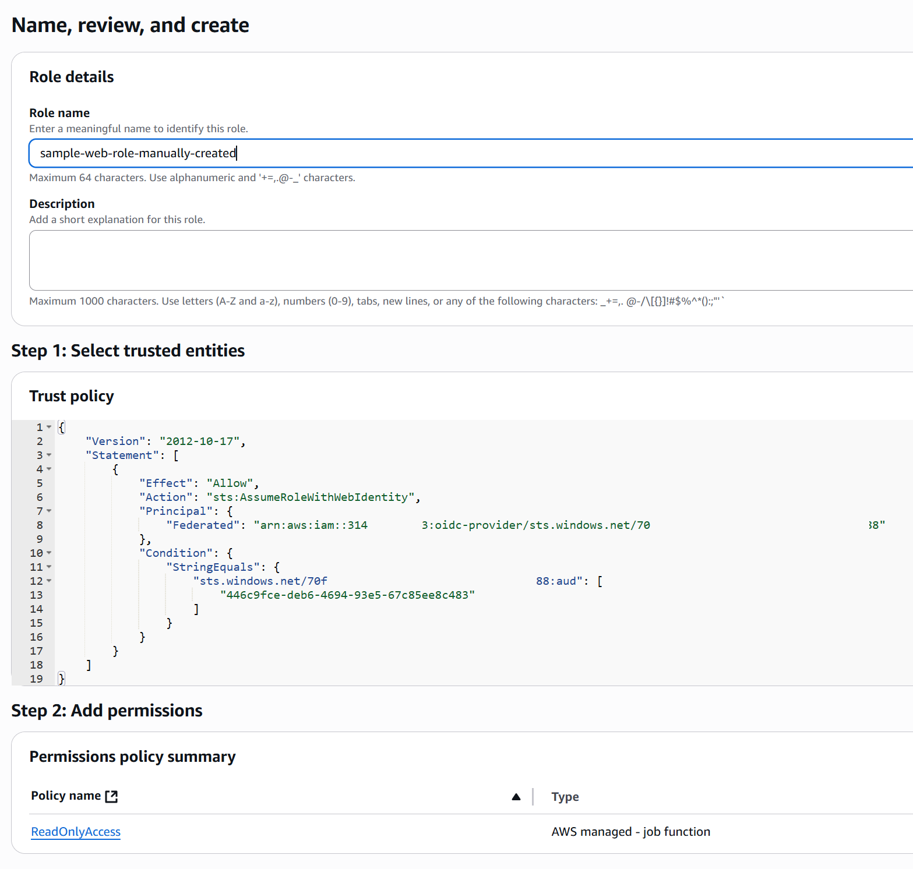
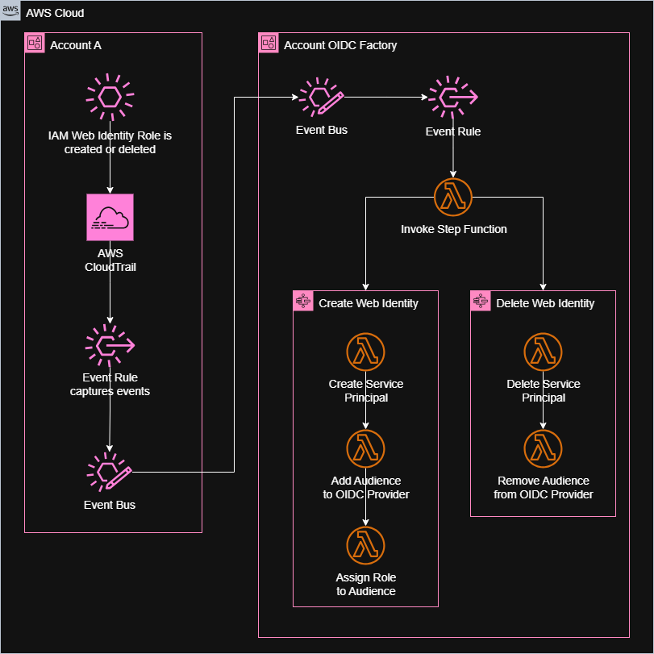
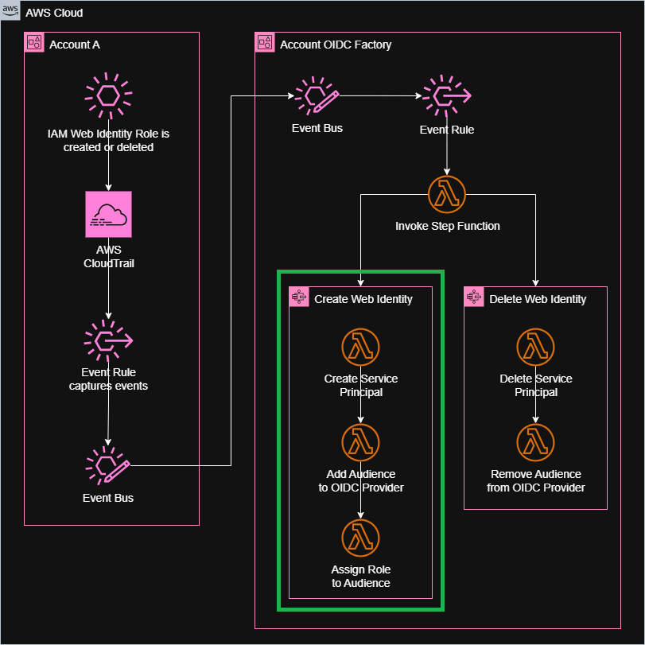
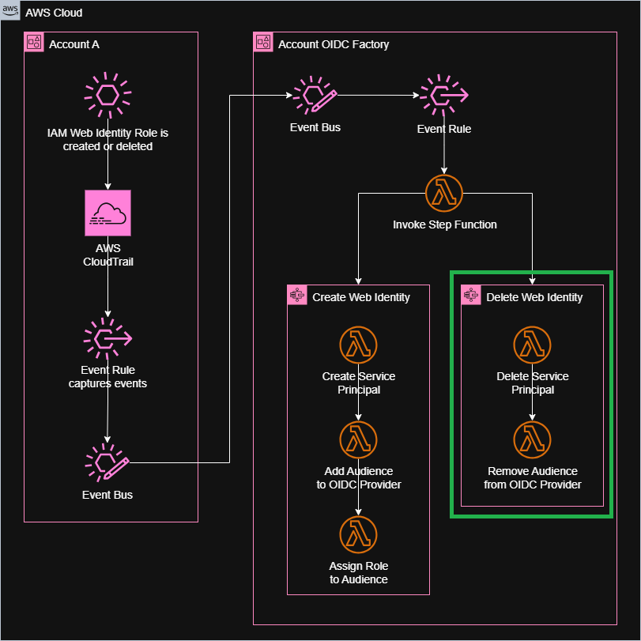
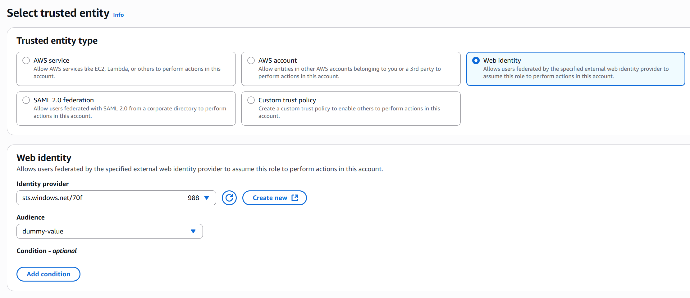
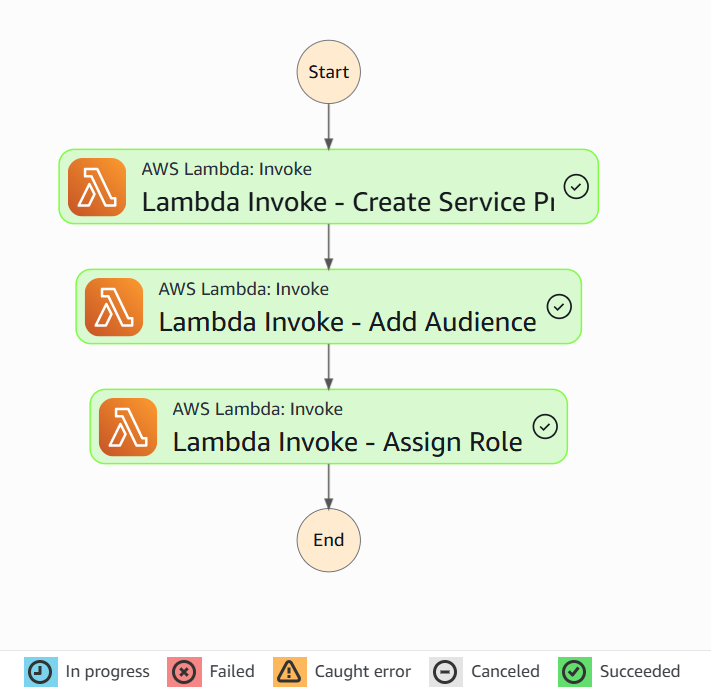
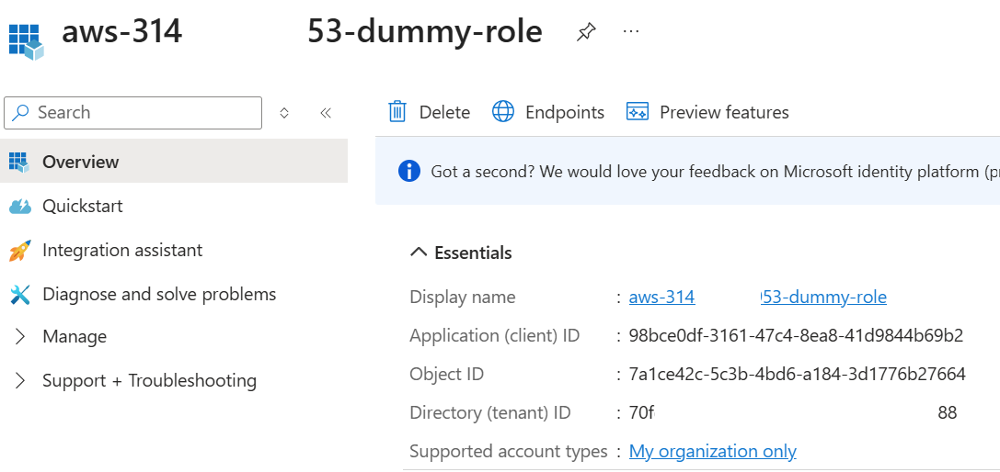

<!-- 

Title Slide

-->
# Automating Secure OIDC-Based Cross-Cloud Authentication

## Commit Your Code 2025

### Borko Djurkovic

---

<!--

Slide: About Me

Recommended podcast: Stuff You Should Know

Running: Rideau Canal in Ottawa

-->
## ABOUT ME

<style>
@import 'https://cdnjs.cloudflare.com/ajax/libs/font-awesome/4.7.0/css/font-awesome.min.css';
</style>


👨🏻‍💻 Software Engineer

🗺 Ottawa, Canada

🏃🏻‍➡️ Runner

<i class="fa fa-podcast"></i> Podcast Listener

🔭 Physics Enthusiast

---

<!--

Slide: Key Takeaways

-->
## Key Takeaways

- Do not use Access Key IDs and Secret Access Keys
- Use OIDC for secure system-to-system authentication
- Leverage automation at scale to improve security and reliability

---

<!-- 

Slide: AWS IAM

- Creation and management of user identities (users, groups, and roles) within AWS.
- Permissions are granted through IAM policies that define what actions are allowed on specific resources.
- IAM roles used to assign these permissions to users or groups.
- Fine grained access control helps implement the principle of least privilege by ensuring users only have the permissions needed for their role.

- IAM integrates with external identity providers (e.g., Microsoft Entra ID, Okta) to enable Single Sign-On (SSO) capabilities.
- Supports both SAML (Security Assertion Markup Language) and OIDC (OpenID Connect) for federating access to AWS.
- Reducing the need for separate AWS credentials and improving security with centralized user management.

- AWS IAM enables issuance of temporary security credentials through AWS Security Token Service (STS).
- Temporary credentials are automatically revoked after a set time, reducing the risk of stale access permissions.

-->
## AWS IAM Service

### Provides Centralized Identity and Access Management

- Identity Management
  - Users, Groups, Roles
- Permissions Management and RBAC
  - IAM Policies, IAM Roles
- Federated access through integration with external IdP's
  - SSO using SAML or OIDC
- AWS STS
  - Temporary Credentials and Session Management

---

<!--

Slide AWS IAM Authentication

- Access keys are used to authenticate users or services when interacting with AWS resources via the API, AWS CLI, or SDKs.
- Access Key ID is public
- Secret Access Key is private and must be kept secure.
- The Access Key ID and Secret Access Key pair work like a username and password for API calls.
- Together, they allow programmatic authentication without needing console credentials.
- Example: AWS Credentials File

-->
## Access Keys for Programmatic Authentication

- Access Key ID is public
- Secret Access Key is private
  - Must be kept secure

```bash
[user1]
aws_access_key_id=ASIAI44QH8DHBEXAMPLE
aws_secret_access_key=je7MtGbClwBF/2Zp9Utk/h3yCo8nvbEXAMPLEKEY
```

---

<!--

Slide: DO NOT USE SECRET KEYS

- Long-term access keys can be compromised if exposed or mishandled, leading to persistent security risks.
- Against prescribed AWS security best practices.
- Managing access keys across multiple users, services, and systems becomes complex as environments grow.
- Access keys are harder to track and audit compared to IAM roles.
- Against corporate, enterprise, or regulatory security policies.
- Access keys are tied to specific IAM users. Can't use RBAC to only assume roles needed for specific use cases.

-->
## DO NOT USE ACCESS KEYS

- Security risk with long term credentials
- Against security best practices
- Difficult to manage at scale
- Against corporate or regulatory security policies
- Associated with IAM Users

---

<!--

Slide: OIDC

- OIDC (OpenID Connect) is an authentication layer built on top of OAuth 2.0, enabling identity verification using tokens.
- These tokens can carry claims (user info) and scopes (permissions).
- This allows fine-grained authorization in apps by controlling what data users can access based on their identity.
- OIDC tokens are short-lived and can be dynamically scoped, reducing the risk of stale or overly broad permissions that are common with IAM access keys.
- It allows applications to authenticate users via external identity providers (e.g. Microsoft Entra ID).
- OIDC is commonly used for Single Sign-On (SSO), allowing users to log in once and access multiple apps.
- Reduces the need for separate credentials in AWS IAM.
- OIDC provides more secure and scalable user authentication compared to long-term AWS IAM access keys, which are prone to exposure and management overhead.

-->
## Better Alternative: Use OIDC

### OIDC enables federated identity management across applications and services

- Provides identity verification using tokens
- Enables fine-grained authorization using claims and scopes
- OIDC tokens are short lived and dynamically scoped
- Enables federated access allowing IdP's to authenticate users for third party apps
- More secure than AWS IAM access keys

---

<!--

Slide: AWS OIDC Provider

- AWS IAM OIDC Provider allows external identity providers (like Microsoft Entra ID) to authenticate users for access to AWS services.
- It enables federated access, allowing users to sign in using their existing credentials in those external IdP, without needing separate AWS IAM user accounts.
- Useful for scenarios where users need access to AWS resources but should not have IAM user credentials (e.g., external contractors, third-party services).
- Reduces the risk of credential leakage by using short-lived tokens instead of long-term AWS IAM access keys.
- IAM Web Identity Roles allow users to obtain permissions in AWS using tokens from external identity providers.

-->
## AWS IAM OIDC Provider

- Integration with external OIDC IdP's for authentication to AWS
- Enables federated access and SSO
- Removes need for AWS IAM users and long-lived AWS IAM access keys
- External users assume AWS IAM Web Identity Roles

---

<!--

Slide: ENTRA ID

- Entra ID (formerly Azure Active Directory) is a comprehensive cloud-based IdP
- Provides tools to manage lifecycle of users such as provisioning and deprovisioning, access permissions.
- Governance and security - conditional access policies, MFA, advanced reporting
- Federated access enabling SSO via SAML or OIDC
- Provides ability to register exrternal applications and configure OIDC

-->
## Microsoft Entra ID = Azure based IdP

- Microsoft Azure-based IAM solution (formerly Azure Active Directory)
- Provides IdP functionality (e.g. user management)
- Identity and security governance
- Supports SAML and OIDC
- Application registration for external apps

---

<!--

Slide: Integrated Solution

- An external application (e.g. CI/CD) is registered in Entra ID.
- An external application logs in with an Azure service principal.
- When a login with the service principal is successful, Entra ID provides the client with a token that specifies the roles, audience, and permissions available to the client in Entra ID.
- The client uses the token obtained from Microsoft Entra ID to exchange it with a temporary token from AWS STS.
- AWS STS generates a temporary token and provides it to the client.
- The client is able to assume the IAM Web Identity Role and gain access to the resources permitted for that role.
- A trust policy within the IAM Web Identity Role authorizes AWS STS to exchange an Entra ID token for an AWS STS token.

-->
## AWS + Entra ID Integrated Solution



1. External application is registered in Entra ID
2. Upon login, Entra ID provides a token
3. The client uses the Entra ID token to obtain a temporary token from AWS STS
4. The client assumes the IAM Web Identity Role

---

<!--

Slide: Configuration Steps

-->
## Configuration Steps

1. Create Application Registration in Entra ID
2. Add Audience to AWS IAM OIDC Provider
3. Create AWS IAM Web Identity Role

---

<!--

Slide: Manual setup - App Registration

-->
## Manual Configuration - Application Registration in Entra ID

<style>
img[alt~="center"] {
  display: block;
  margin: 0 auto;
}
</style>


---

<!--

Slide: Manual setup - App Registration

-->
## Manual Configuration - Application Registration in Entra ID

<style>
img[alt~="center"] {
  display: block;
  margin: 0 auto;
}
</style>



---

<!--

Slide: Manual setup - AWS IAM OIDC Provider Configuration

OIDC Provider configured for the Entra ID tenant

-->
## Manual Configuration - AWS IAM OIDC Provider Configuration

<style>
img[alt~="center"] {
  display: block;
  margin: 0 auto;
}
</style>


---

<!--

Slide: Manual setup - IAM Web Identity Role Configuration

-->
## Manual Configuration - IAM Web Identity Role Configuration

<style>
img[alt~="center"] {
  display: block;
  margin: 0 auto;
}
</style>



---

<!--

Slide: Manual setup - IAM Web Identity Role Configuration

-->
## Manual Configuration - IAM Web Identity Role Configuration

```json
{
    "Effect": "Allow",
    "Action": "sts:AssumeRoleWithWebIdentity",
    "Principal": {
        "Federated":
        "arn:aws:iam::<account>:oidc-provider/
        sts.windows.net/<tenant>"
    },
    "Condition": {
        "StringEquals": {
            "sts.windows.net/tenant:aud": [
                "<audience>"
            ]
        }
    }
}
```



---

<!--

Slide 10: Challenges of Manual Setup in Enterprise Environments

- Results in a violation of enterprise security policies and compliance because, when done by different individuals, it will result in varying approaches and setups.
- Needs substantial access privileges in both AWS and the IdP, potentially leading to significant security risks.
- Requires a deep understanding of both platforms, a competence that can be lacking in many companies.
- Manual configurations are commonly error prone.

-->
## Challenges of Manual Setup in Enterprise Environments

- Violation of enterprise security policies
- Different individuals use varying approaches and setups
- Requires elevated privileges in both AWS IAM and Entra ID
- Requires deep understanding of both platforms (AWS IAM and Entra ID)
- Manual configurations are error prone

---

<!--

Slide: Need for automation at scale

- Enterprise organizations use multiple AWS accounts for various purposes (e.g. Logging, Networking, Security).
- Additionally, various business units may have many AWS Accounts.
- Environments (e.g. DEV, TEST, PROD) are often broken up into different AWS accounts.
- Temporary accounts (e.g. for developers, or sandbox environments or POC)
- Many organizations use AWS Control Tower, AWS Landing Zone Accelerator (LZA) or other automation pipelines to programmatically create AWS accounts at scale.
- In these scenarios, automation can create AWS IAM OIDC Provider in each account.
- At scale, we need automation for OIDC configurations.

-->
## Need for automation at scale

<style>
img[alt~="center"] {
  display: block;
  margin: 0 auto;
}
</style>


---

<!--

Slide: OIDC Configuration - Automated Solution

- Account A is a newly created account (via automation)
- On the right, we have a centralized OIDC factory account that implements the automation solution
- Process starts with creation or deletion of an IAM Web Identity Role in one of the newly created member accounts.
- AWS CloudTrail records the event.
- Event Rule captures these specific events and sends them to an Event Bus
- In the OIDC Factory Account, we also have an event rule
- Event rule triggers a Lambda Function that then invokes one of two Step Function workflows.

-->
## OIDC Configuration - Automated Solution

<style>
img[alt~="center"] {
  display: block;
  margin: 0 auto;
}
</style>



---

<!--

Slide: Solution Components - Creation of IAM Web Identity Role

- **Create Service Principal Lambda**
  - Function calls a Entra ID API to register a new application.
  - The Lambda function returns a unique audience identifier for the Entra ID application.

- **Add Audience to OIDC Provider Lambda**
  - Function receives an audience identifier. It adds the audience identifier to the pre-deployed IAM OIDC Provider in the newly-created AWS account.

- **Assign Role to Audience Lambda**
  - Function updates the trust relationship in the IAM Web Identity Role by adding the audience identifier of the application registration to allow the newly-created service principal to assume the Web Identity Role.
  - This step is required because, unlike a manual setup, the AWS user that creates the web identity role does not have an audience identifier so users enter any dummy value. This will be overwritten few seconds later by the automation.

-->
## Creation of IAM Web Identity Role Workflow



<style scoped>
section {
    font-size: 24px;
}
</style>

- **Create App Registration Lambda**
  - Invokes Entra ID API to register a new application.

- **Add Audience to OIDC Provider Lambda**
  - Adds the audience identifier to the IAM OIDC Provider.

- **Assign Role to Audience Lambda**
  - Updates the trust relationship in the IAM Web Identity Role to add the audience identifier.

---

<!--

Slide: Solution Components - Deletion of IAM Web Identity Role

- **Delete Service Principal Lambda**
  - Invokes Entra ID API to delete the existing app registration.

- **Remove Audience from OIDC Provider Lambda**
  - Removes the audience identifier from the IAM OIDC Provider.

-->
## Deletion of IAM Web Identity Role Workflow



<style scoped>
section {
    font-size: 24px;
}
</style>

- **Delete App Registration Lambda**
  - Invokes Entra ID API to delete the existing app registration.

- **Remove Audience from OIDC Provider Lambda**
  - Removes the audience identifier from the IAM OIDC Provider.

---

<!-- Slide: Key Takeaways -->
## Key Takeaways

- Do not use Access Key IDs and Secret Access Keys
- Use OIDC for secure system-to-system authentication
- Leverage automation at scale to improve security and reliability

---

<!--

Slide: Info & Source Code

-->
## Additional Info

<style>
@import 'https://cdnjs.cloudflare.com/ajax/libs/font-awesome/4.7.0/css/font-awesome.min.css';
</style>

<i class="fa fa-github"></i> https://github.com/borkod/aws-oidc-automation

<svg xmlns="http://www.w3.org/2000/svg" height="32" width="32" viewBox="0 0 640 640"><path fill="#ffffff" d="M192 144C222.9 144 248 118.9 248 88C248 57.1 222.9 32 192 32C161.1 32 136 57.1 136 88C136 118.9 161.1 144 192 144zM176 576L176 416C176 407.2 183.2 400 192 400C200.8 400 208 407.2 208 416L208 576C208 593.7 222.3 608 240 608C257.7 608 272 593.7 272 576L272 240L400 240C417.7 240 432 225.7 432 208C432 190.3 417.7 176 400 176L384 176L384 128L576 128L576 320L384 320L384 288L320 288L320 336C320 362.5 341.5 384 368 384L592 384C618.5 384 640 362.5 640 336L640 112C640 85.5 618.5 64 592 64L368 64C341.5 64 320 85.5 320 112L320 176L197.3 176C151.7 176 108.8 197.6 81.7 234.2L14.3 324.9C3.8 339.1 6.7 359.1 20.9 369.7C35.1 380.3 55.1 377.3 65.7 363.1L112 300.7L112 576C112 593.7 126.3 608 144 608C161.7 608 176 593.7 176 576z"/></svg> https://github.com/borkod/CYC2025

<i class="fa fa-globe"></i> https://www.b3o.tech/

<svg xmlns="http://www.w3.org/2000/svg" height="32" width="32" viewBox="0 0 640 640"><path fill="#ffffff" d="M439.8 358.7C436.5 358.3 433.1 357.9 429.8 357.4C433.2 357.8 436.5 358.3 439.8 358.7zM320 291.1C293.9 240.4 222.9 145.9 156.9 99.3C93.6 54.6 69.5 62.3 53.6 69.5C35.3 77.8 32 105.9 32 122.4C32 138.9 41.1 258 47 277.9C66.5 343.6 136.1 365.8 200.2 358.6C203.5 358.1 206.8 357.7 210.2 357.2C206.9 357.7 203.6 358.2 200.2 358.6C106.3 372.6 22.9 406.8 132.3 528.5C252.6 653.1 297.1 501.8 320 425.1C342.9 501.8 369.2 647.6 505.6 528.5C608 425.1 533.7 372.5 439.8 358.6C436.5 358.2 433.1 357.8 429.8 357.3C433.2 357.7 436.5 358.2 439.8 358.6C503.9 365.7 573.4 343.5 593 277.9C598.9 258 608 139 608 122.4C608 105.8 604.7 77.7 586.4 69.5C570.6 62.4 546.4 54.6 483.2 99.3C417.1 145.9 346.1 240.4 320 291.1z"/></svg> [@b3o.tech](https://bsky.app/profile/b3o.tech)

<svg xmlns="http://www.w3.org/2000/svg" height="32" width="32" viewBox="0 0 640 640"><path fill="#ffffff" d="M453.2 112L523.8 112L369.6 288.2L551 528L409 528L297.7 382.6L170.5 528L99.8 528L264.7 339.5L90.8 112L236.4 112L336.9 244.9L453.2 112zM428.4 485.8L467.5 485.8L215.1 152L173.1 152L428.4 485.8z"/></svg> [@borkod](https://x.com/borkod)

<i class="fa fa-linkedin"></i> https://www.linkedin.com/in/borkod/

---
---
<!--

Appendix

-->

## Appendix

<!--

Slide: Demo - IAM Web Identity Role Creation

-->
## Demo - IAM Web Identity Role Creation

<style>
img[alt~="center"] {
  display: block;
  margin: 0 auto;
}
</style>



---

<!--

Slide: Demo - IAM Web Identity Role Creation

-->
## Demo - IAM Web Identity Role Creation

<style>
img[alt~="center"] {
  display: block;
  margin: 0 auto;
}
</style>


---

<!--

Slide: Demo - Step Function Execution

-->
## Demo - Step Function Execution

<style>
img[alt~="center"] {
  display: block;
  margin: 0 auto;
}
</style>



---

<!--

Slide: Demo - Entra ID App Registration

-->
## Demo - Entra ID App Registration

<style>
img[alt~="center"] {
  display: block;
  margin: 0 auto;
}
</style>



---

<!--

Slide: Demo - AWS IAM OIDC Provider Audience

-->
## Demo - AWS IAM OIDC Provider Audience

<style>
img[alt~="center"] {
  display: block;
  margin: 0 auto;
}
</style>


---

<!--

Slide: Demo - AWS IAM Role Audience Update

-->
## Demo - AWS IAM Role Audience Update

<style>
img[alt~="center"] {
  display: block;
  margin: 0 auto;
}
</style>


